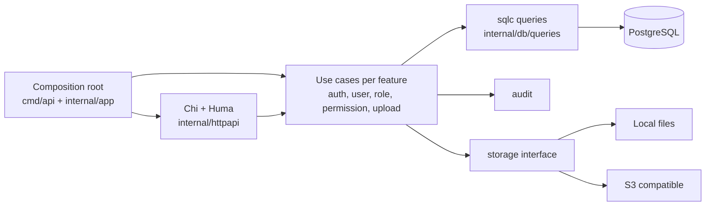

# Modular Go Backend

[](https://github.com/RidhuanDEV/golang-backend/actions/workflows/ci.yml)

Starter **modular monolith** untuk membangun HTTP API dengan Go, PostgreSQL, Chi, Huma, dan sqlc. Cocok untuk tim yang ingin memulai dari auth, RBAC, audit, upload lokal/S3, rate limiting, cache Redis opsional, OpenAPI, dan container setup yang sudah terhubung.

Proyek ini ditujukan untuk satu aplikasi yang dikembangkan dan dirilis sebagai satu unit dengan batas package per fitur. Pilih layanan terpisah bila fitur perlu dirilis, diskalakan, atau dimiliki secara independen. Database aplikasi ini milik proyek Go dan tidak berbagi schema dengan starter Express atau stack lain.

Perlu Go 1.27.1 untuk initializer dan mode manual. Compose memerlukan Docker Engine/Desktop serta Docker Compose v2. Mode manual memerlukan PostgreSQL 18; Redis hanya diperlukan bila cache atau rate store Redis diaktifkan.

## Fitur

- Register/login JWT, RBAC berbasis grant terbaru dari PostgreSQL, dan permission terpisah untuk user, role, dan permission.
- Registry endpoint bertipe untuk auth, akses, audit, rate group, cache, dan OpenAPI.
- Audit before/after pada transaksi mutasi; upload memverifikasi signature file dan mendukung storage lokal atau S3.
- Redis opsional untuk rate limit lintas replica dan cache; satu instance dapat menggunakan rate limiter memory.
- Liveness/readiness, graceful shutdown, OpenTelemetry HTTP, Goose migrations, dan Compose.
- Template initializer membuat project baru dan secret JWT tanpa menyalin `.env` atau data lokal.
- API contract yang sejalan dengan keluarga template Express dan .NET, diverifikasi oleh tes parity. Penjelasan dan cara menyesuaikannya ada di [contract parity](docs/contract-parity.md).

## Buat proyek baru

Initializer saat ini dijalankan dari checkout repository; belum dipublikasikan sebagai paket `go run ...@latest` atau `gonew`.

```sh
git clone https://github.com/RidhuanDEV/golang-backend.git
cd golang-backend
go run ./cmd/initproject ../my-api
cd ../my-api
```

Wizard meminta module path, port, database, pilihan Redis, dan storage. Ia membuat `.env` baru dengan JWT secret acak. Isi `ADMIN_EMAIL` dan `ADMIN_PASSWORD` di `.env` bila ingin membuat akun admin saat menjalankan seed. Jangan gunakan kredensial contoh di production.

Untuk melewati unduh dependency saat inisialisasi:

```sh
go run ./cmd/initproject --no-install ../my-api
```

Tujuan yang sudah berisi file akan ditolak. Initializer tidak menyalin `.git`, `.env`, atau direktori upload dari checkout.

## Quick start dengan Compose

Perlu Docker Engine/Desktop dan Docker Compose v2. Jalankan di folder project hasil initializer:

```sh
# Initializer membuat .env. Pastikan JWT_SECRET dan kredensial DB terisi.
# Opsional: tambahkan ADMIN_EMAIL dan ADMIN_PASSWORD sebelum seed.
docker compose up --build -d
docker compose run --rm --entrypoint seed app
```

Compose menjalankan migrasi satu kali sebelum API dimulai. Seed tetap perintah eksplisit. API tersedia di `http://localhost:3000`, OpenAPI JSON di `/docs/openapi.json`, dan viewer di `/docs`.

Untuk mengecek register dan login, jalankan setelah seed. Ganti email dan password dengan milik Anda:

```sh
curl -sS http://localhost:3000/api/auth/register -H 'Content-Type: application/json' -d '{"email":"dev@example.com","password":"change-this-password"}'
curl -sS http://localhost:3000/api/auth/login -H 'Content-Type: application/json' -d '{"email":"dev@example.com","password":"change-this-password"}'
# Salin token dari data.token pada response login.
curl -sS http://localhost:3000/api/auth/me -H 'Authorization: Bearer <token>'
# Saat access token kedaluwarsa, rotasi refresh token dan simpan nilai baru dari data.refreshToken.
curl -sS http://localhost:3000/api/auth/refresh -H 'Content-Type: application/json' -d '{"refreshToken":"<refresh-token>"}'
```

PowerShell juga dapat memakai `Invoke-RestMethod`:

```powershell
$body = @{ email = 'dev@example.com'; password = 'change-this-password' } | ConvertTo-Json
Invoke-RestMethod http://localhost:3000/api/auth/register -Method Post -ContentType 'application/json' -Body $body
$login = Invoke-RestMethod http://localhost:3000/api/auth/login -Method Post -ContentType 'application/json' -Body $body
$token = $login.data.token
Invoke-RestMethod http://localhost:3000/api/auth/me -Headers @{ Authorization = "Bearer $token" }
```

Untuk mencoba endpoint admin, set `ADMIN_EMAIL` dan `ADMIN_PASSWORD` sebelum seed, login memakai nilai tersebut, lalu panggil `GET /api/users` dengan bearer token. Login mengembalikan access token 15 menit di `data.token` dan refresh token opaque 30 hari di `data.refreshToken`. Kirim refresh token ke `POST /api/auth/refresh` untuk rotasi; token lama hanya dapat dipakai sekali. Endpoint protected menerima `Authorization: Bearer <token>`.

## Cakupan API dan permission

| Area | Endpoint utama | Akses |
| --- | --- | --- |
| Auth | `POST /api/auth/register`, `POST /api/auth/login`, `POST /api/auth/refresh`, `GET /api/auth/me` | Register/login/refresh publik dan dibatasi rate group `auth`; `me` memerlukan JWT |
| User | `GET/POST /api/users`, `GET/PATCH/DELETE /api/users/{id}` | `manage_users` |
| Role | `GET/POST /api/roles`, `GET/PATCH/DELETE /api/roles/{id}`, `POST /api/roles/{id}/permissions` | `manage_roles` |
| Permission | `GET/POST /api/permissions`, `GET/PATCH/DELETE /api/permissions/{id}` | `manage_permissions` |
| Upload | `POST /api/upload`, `GET /api/upload/{id}` | `manage_users` saat ini |
| System/docs | `/health`, `/live`, `/ready`, `/docs`, `/docs/openapi.json`, `/docs/specs/{module}.json` | Publik |

Seed membuat role `admin` dan `user`, serta permission `manage_users`, `manage_roles`, dan `manage_permissions`; semua permission itu diberikan ke role admin. Endpoint register memberi role `user`. DTO auth/user hanya menampilkan ID, email, role, dan timestamp publik; password serta `deletedAt` internal tidak dikirim. Upload belum memiliki permission tersendiri dan endpoint GET upload hanya mengembalikan metadata, bukan bytes atau presigned URL. Pertimbangkan permission khusus dan alur download sebelum mengadopsi upload untuk aplikasi pengguna.

## Arsitektur



`internal/httpapi` owns transport DTOs, Huma operations, registry policy, and error envelopes. Feature services own use cases. `internal/db/queries` is the source for generated sqlc methods under `internal/db/sqlc`; `internal/model` contains response/domain data types. `cmd/api` and `internal/app` wire concrete dependencies. Goose migrations live in `internal/db/migrations` and are embedded by the DB package.

The repository tests endpoint/OpenAPI consistency and API contract parity. They do not currently enforce every package dependency rule with a dedicated architecture checker. Keep feature packages independent of HTTP transport and put new wiring in the composition root.

## Tambah modul

Ikuti [panduan membuat modul](docs/module-guide.md) untuk langkah lengkap: migration, query sqlc, service, endpoint Huma, registry, permission, audit, dan verifikasi. Perubahan database dibuat oleh migration Goose; jangan mengubah model sqlc generated secara manual.

## Konfigurasi penting

[`.env.example`](.env.example) mencantumkan seluruh opsi. Perubahan environment berlaku setelah proses dimulai ulang atau deployment baru.

| Variable | Default | Kegunaan |
| --- | --- | --- |
| `PORT` / `APP_PORT` | `3000` | Port aplikasi di container / port host Compose |
| `DATABASE_URL` | local PostgreSQL | PostgreSQL milik aplikasi ini |
| `JWT_SECRET` | placeholder | Wajib, minimal 32 karakter; initializer menghasilkan nilai acak |
| `ADMIN_EMAIL` / `ADMIN_PASSWORD` | kosong | Opsional; membuat akun admin saat seed |
| `CORS_ORIGINS` | localhost:5173, localhost:3000 | Origin browser yang diizinkan; production wajib eksplisit |
| `RATE_LIMIT_STORE` | `memory` | `redis` untuk berbagi quota antar replica |
| `APP_INSTANCE_COUNT` | `1` | Set jumlah replica; nilai lebih dari satu mewajibkan Redis limiter |
| `RATE_LIMIT_<AUTH\|PUBLIC\|INTERNAL>_WINDOW_MS` | `900000` | Jendela quota tiap group |
| `RATE_LIMIT_<AUTH\|PUBLIC\|INTERNAL>_MAX` | `20` / `100` / `300` | Maksimum request per group per jendela |
| `CACHE_ENABLED` | `false` | Aktifkan cache Redis opsional untuk endpoint yang mendukungnya |
| `ENDPOINT_POLICIES_JSON` | `{}` | Override audit, rate group, dan cache per endpoint ID |
| `UPLOAD_ENABLED` | `true` | Aktif/nonaktif upload |
| `UPLOAD_STORAGE` | `local` | `local` atau `s3`; folder lokal diatur oleh `UPLOAD_LOCAL_DIR` |
| `REDIS_URL` | localhost | Diperlukan bila rate store atau cache memakai Redis |
| `OTEL_ENABLED` | `false` | Kirim trace dan metrik HTTP via OTLP HTTP |

Permintaan tanpa header `Origin` tetap dapat diproses untuk klien server-to-server atau CLI. Browser tetap mengikuti allowlist CORS; ini tidak mengizinkan origin browser yang tidak terdaftar. Detail policy, cache outage, rate behavior, proxy, dan storage ada di [konfigurasi operasi](docs/OPERATIONS.md).

Untuk menyalakan dependency opsional lewat Compose, set `COMPOSE_PROFILES=redis`, `minio`, atau `redis,minio` di `.env`. Gunakan MinIO profile untuk development lokal; untuk production pilih layanan S3 yang aktif dipelihara.

## Tanpa Docker

Salin `.env.example` ke `.env`, atur `DATABASE_URL` ke database kosong dan isi secret, lalu:

```sh
go run ./cmd/migrate
go run ./cmd/seed
go run ./cmd/api
```

Jalankan di PowerShell dengan perintah Go yang sama; `.env` dimuat oleh aplikasi. Migrasi dan seed tidak berjalan otomatis saat API startup. Lihat [panduan testing](docs/testing.md) untuk integration test dan regenerasi query tanpa `make`.

## API docs dan security

Huma menghasilkan OpenAPI dari operasi HTTP yang sama dengan request runtime. `/docs/openapi.json` menyediakan spesifikasi; `/docs` memuat Redoc 2.5.4 dari jsDelivr dengan versi dan SRI integrity hash yang dipin. Bila Content Security Policy diterapkan, izinkan `https://cdn.jsdelivr.net` pada `script-src` dan origin API sendiri pada `connect-src`. Jika dokumentasi tidak boleh publik, batasi path `/docs` pada ingress/reverse proxy; aplikasi belum memiliki env flag untuk menonaktifkannya.

Access JWT berlaku 15 menit dan refresh token opaque berlaku sampai 30 hari sejak login. Refresh token hanya disimpan sebagai SHA-256 hash, dirotasi setiap kali dipakai, dan pemakaian ulang token yang telah dicabut membatalkan seluruh keluarga token. Refresh token tidak diperpanjang melewati batas expiry keluarga. Access token lama tanpa claim `tokenUse` ditolak setelah upgrade ini; pengguna perlu login sekali lagi. Belum ada endpoint logout atau revocation manual; sesi dapat dihentikan dengan replay detection, penghapusan akun, atau menunggu expiry. Akun dan permission tetap diperiksa terhadap database pada request terlindungi. Password dibatasi 72 byte karena bcrypt, upload memakai UUID dan memeriksa signature file, credentialed CORS nonaktif, dan forwarded headers tidak dipercaya secara default.

## Testing dan operasional

`go test ./...` menjalankan unit/contract tests. Tanpa `DATABASE_URL`, integration tests PostgreSQL di-skip; hasil itu tidak membuktikan alur database lulus. Tes Redis juga memerlukan Redis sesuai environment. Gunakan database disposable, bukan database production. Login dan refresh selalu memakai rate group `auth`; limiter memory membagi kuota hanya dalam satu instance. Untuk beberapa replica, atur `APP_INSTANCE_COUNT` sesuai jumlah replica, `RATE_LIMIT_STORE=redis`, `REDIS_URL`, dan Compose profile `redis`. Jika Redis limiter gagal, endpoint auth menolak request dengan 503.

- [Testing, generation, dan CI](docs/testing.md)
- [Runbook deployment, backup, dan restore](docs/OPERATIONS.md)
- [Contract parity antar template](docs/contract-parity.md)

## Lisensi dan kontribusi

Repository ini belum menyertakan file lisensi. Hak penggunaan ulang belum diberikan secara eksplisit; tentukan dan tambahkan lisensi sebelum mendistribusikan template. Panduan kontribusi ada di [CONTRIBUTING.md](CONTRIBUTING.md); pelaporan kerentanan dijelaskan di [SECURITY.md](SECURITY.md).
